# Hitos // OnlyFlans

Configuración de página web de onlyflans Desafio Latam


## Freeze

```bash
    asgiref==3.8.1
    backports.zoneinfo==0.2.1
    Django==4.2
    sqlparse==0.4.4
    typing_extensions==4.11.0
    tzdata==2024.1
```


## Screenshots
<details>

<summary>Hito 1</summary>

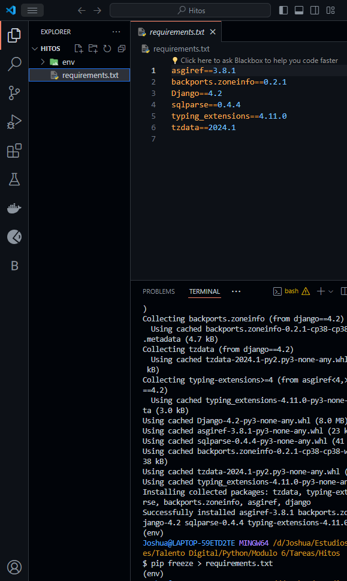
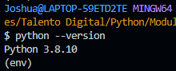
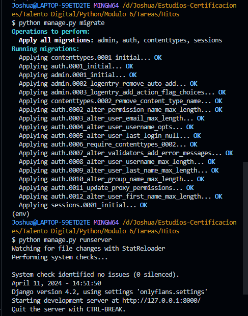
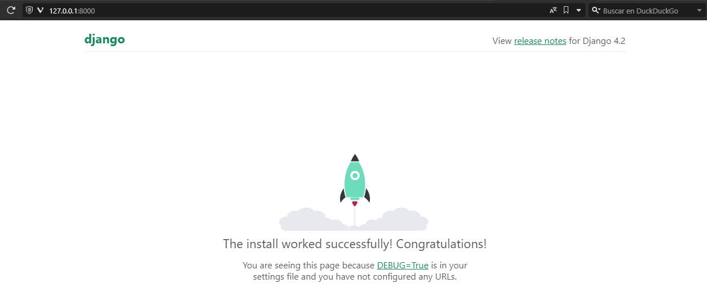

</details>
<details>

<summary>Hito 2</summary>

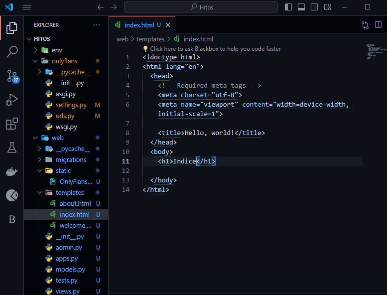
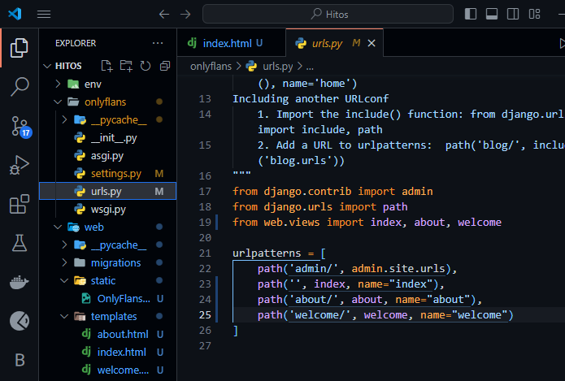
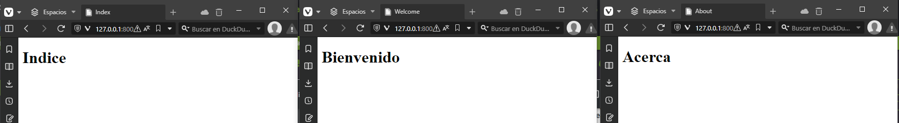
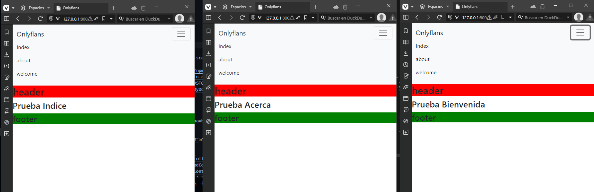
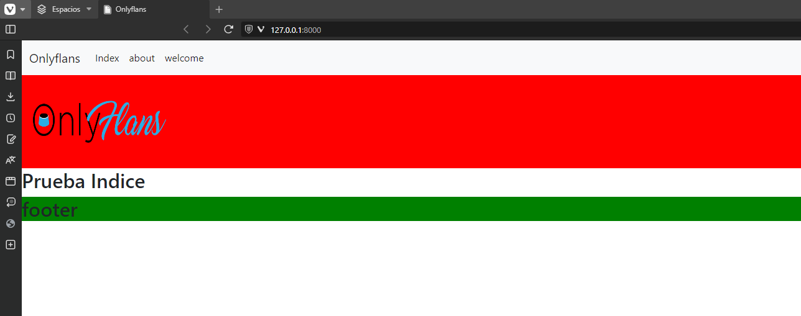

</details>
<details>

<summary>Hito 3</summary>

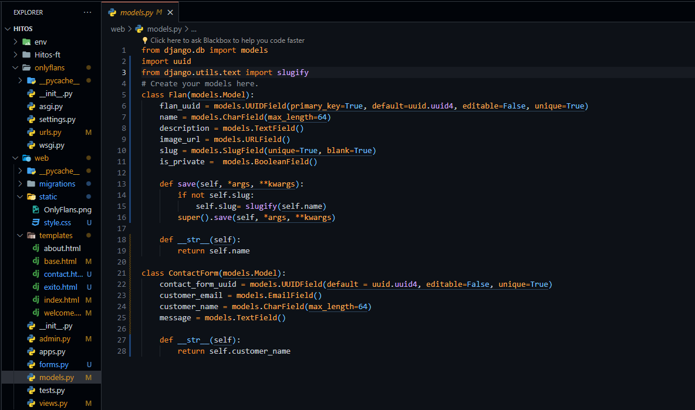
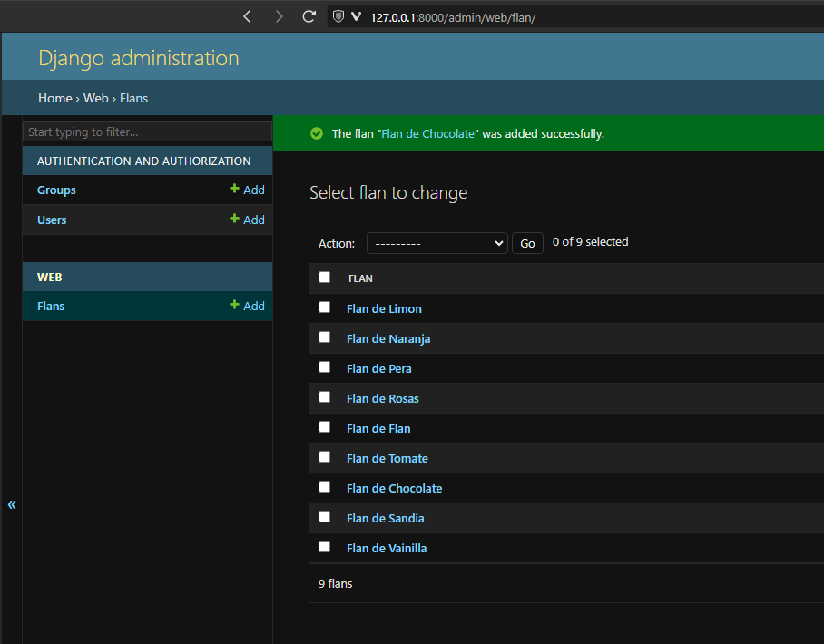
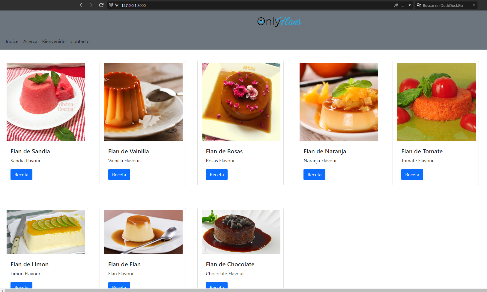
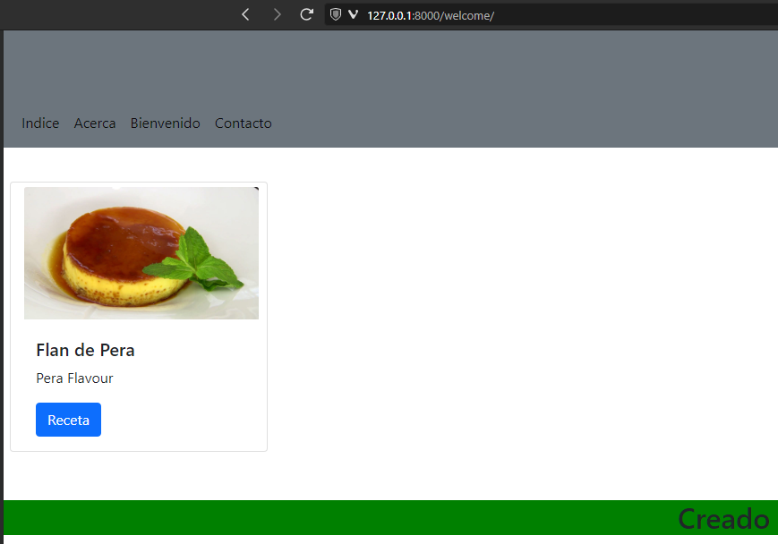
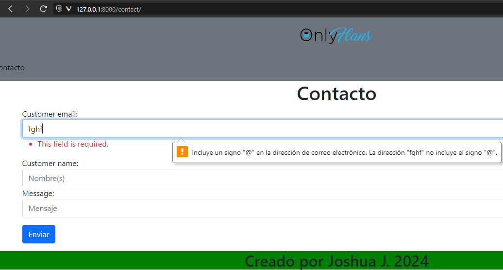
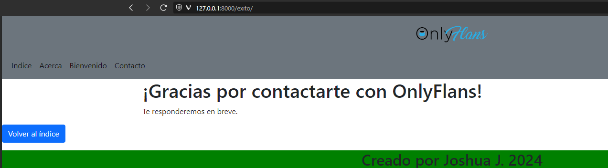
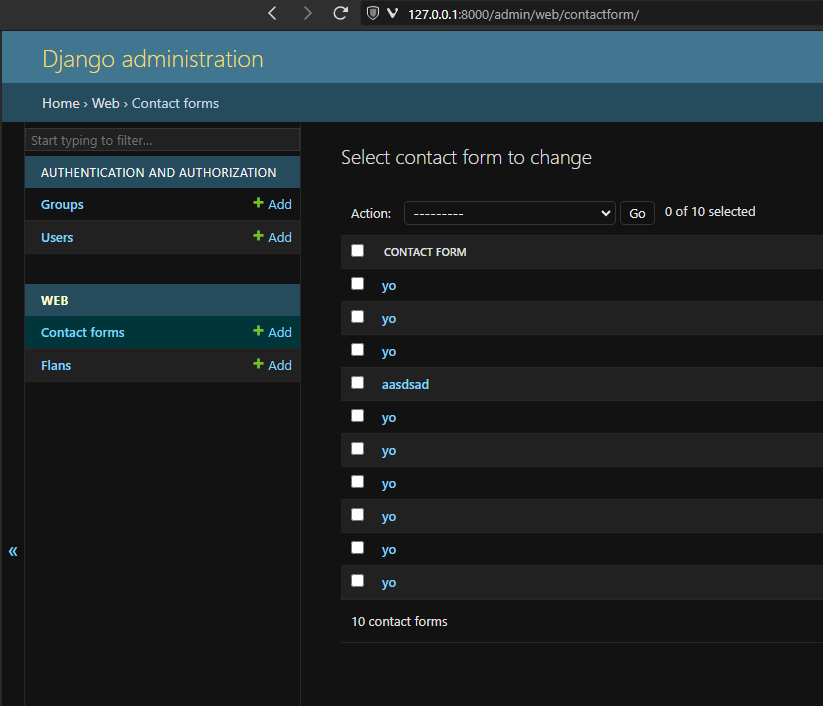


</details>


## 🔗 Links
[](https://www.linkedin.com/in/jj-joshua)

